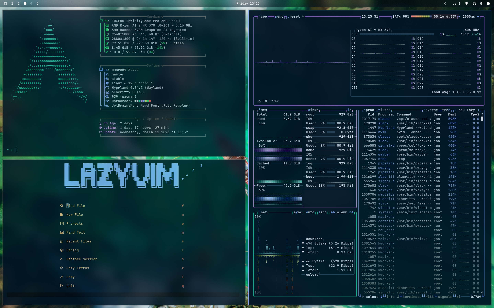
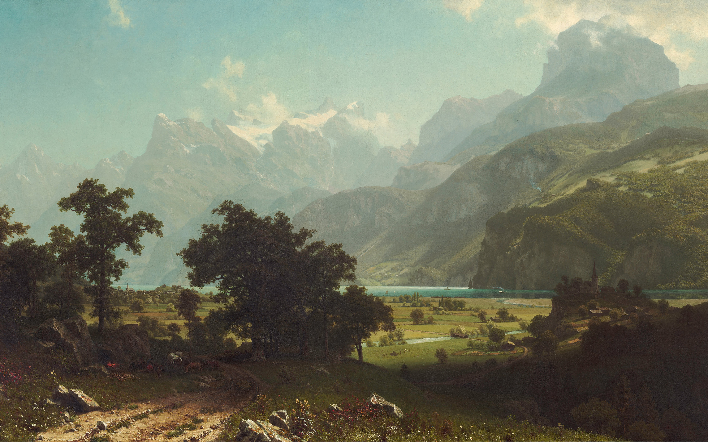

# Night Owl Theme for Omarchy

A dark theme for [Omarchy](https://omarchy.org/) based on [Night Owl](https://github.com/sdras/night-owl-vscode-theme) by [Sarah Drasner](https://github.com/sdras).

Night Owl is designed for contrast and accessibility during nighttime coding, with carefully chosen colors that are easy on the eyes while maintaining readability.



## Backgrounds

<table>
  <tr>
    <td></td>
    <td></td>
    <td></td>
    <td></td>
  </tr>
  <tr>
    <td></td>
    <td></td>
    <td></td>
    <td></td>
  </tr>
</table>

## Install

```bash
omarchy-theme-install https://github.com/janhesters/omarchy-night-owl-theme
```

This installs and immediately applies the theme. You can also switch to it later with:

```bash
omarchy-theme-set night-owl
```

## What's themed

- Terminal (Ghostty / Alacritty / Kitty)
- Waybar (status bar)
- Walker (app launcher)
- Mako (notifications)
- Hyprland & Hyprlock
- SwayOSD
- btop
- Neovim (via [oxfist/night-owl.nvim](https://github.com/oxfist/night-owl.nvim))
- VS Code (via [sdras.night-owl](https://marketplace.visualstudio.com/items?itemName=sdras.night-owl))
- Chromium

## Credits

- **Night Owl** by [Sarah Drasner](https://github.com/sdras) — the original VS Code theme and color palette
- **night-owl.nvim** by [oxfist](https://github.com/oxfist/night-owl.nvim) — Neovim port
